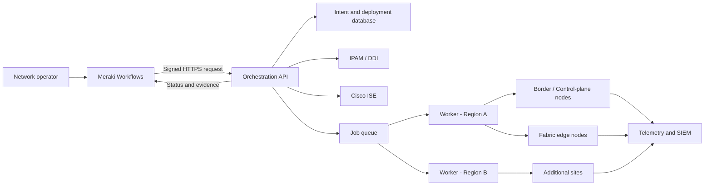

# Meraki Workflows-Driven SDA-Style Fabric

## Production Build and Cisco Live Demonstration Master Guide

Version: 0.1

Status: Architecture and delivery baseline

Target: Production-capable programmable campus fabric, operated from Cisco Meraki Workflows

Data plane: VXLAN

Control plane: LISP for endpoint reachability, BGP for external handoff and route exchange

Underlay: IS-IS or a deliberately selected routed underlay

---

## 1. Executive Summary

This project turns the existing two-switch proof of concept into a repeatable, governed, multi-site workflow that plans, validates, deploys, verifies, and, when necessary, rolls back a LISP/VXLAN campus fabric from Cisco Meraki Workflows.

The solution is intentionally controllerless from a Catalyst Center perspective. Meraki Workflows is the operator-facing orchestration layer. A hardened on-premises execution service translates approved intent into device-specific configuration and operational checks.

This is an SDA-style programmable fabric, not the supported Cisco Catalyst Center SD-Access product. Cisco SD-Access normally includes Catalyst Center lifecycle automation and assurance. Any Cisco Live submission, customer-facing presentation, or production design must state that distinction clearly.

The target outcome is not merely "configuration was accepted." Production success means:

- The intended topology and address plan are valid.
- Every change is previewed and approved.
- Device configuration is deterministic and idempotent.
- Control-plane and data-plane state match the design.
- Endpoint onboarding, DHCP, identity, policy, and telemetry are proven.
- Partial failures stop safely.
- Rollback is tested before deployment.
- Every action is attributable and auditable.

---

## 2. What Is Being Built

### 2.1 Operator Experience

The operator starts and monitors the process in Meraki:

1. Select organization, fabric, site, and change type.
2. Select or import devices and assign roles.
3. Select an approved addressing profile.
4. Define virtual networks, endpoint pools, and handoffs.
5. Select the identity and policy model.
6. Configure services and telemetry.
7. Run read-only discovery and prechecks.
8. Review the generated change plan and impact.
9. Obtain approval.
10. Deploy in bounded waves.
11. Run operational and synthetic tests.
12. Close the change or execute rollback.

### 2.2 Production Components

#### Meraki Workflows

- Operator forms and workflow state
- Approval tasks
- Calls to the orchestration API
- Branching and failure handling
- Run monitoring and user-facing status
- Notifications and evidence links

#### Orchestration API

- Authenticates Meraki Workflow requests
- Validates request schemas
- Stores intent and deployment state
- Produces plans and diffs
- Creates deployment jobs
- Returns job status and evidence
- Never executes arbitrary user-supplied commands

#### Intent and Inventory Store

- Organizations, regions, fabrics, sites, and buildings
- Devices, interfaces, links, roles, capabilities, and software
- IP pools, allocations, VRFs, VNIs, VLANs, and SGTs
- Desired-state versions
- Deployments, approvals, evidence, and rollback references

#### Execution Workers

- Connect to device management addresses
- Render configuration from approved templates
- Take checkpoints
- Apply changes in dependency order
- Parse operational state
- Submit structured results
- Enforce per-site concurrency and locking

#### External Systems

- IPAM/DDI for address allocation and DHCP
- Cisco ISE for RADIUS, profiling, authorization, and SGT assignment
- Secret manager for device and API credentials
- ITSM/change system when required
- Syslog, flow collector, metrics platform, and SIEM

---

## 3. Reference Architecture



### 3.1 Trust Boundaries

- Meraki Workflows does not receive switch passwords.
- Account keys or OAuth credentials are stored using secure workflow credential facilities.
- The public API endpoint is protected by TLS, request signing, replay protection, rate limiting, and an allowlist where possible.
- Workers initiate management sessions from controlled network zones.
- Device credentials come from a secret manager at execution time.
- Production workers cannot execute repository-provided arbitrary shell scripts.

### 3.2 Availability

Minimum production design:

- Two orchestration API instances behind a load balancer
- PostgreSQL with backup and point-in-time recovery
- Durable job queue
- At least two workers per production region or management domain
- Health checks and alerting for API, database, queue, and workers
- No in-memory-only deployment state

---

## 4. Product Positioning for Cisco Live

Recommended title:

> From Meraki Workflow to Programmable Campus Fabric: Automating a LISP/VXLAN Deployment Without Catalyst Center

Claims that can be demonstrated:

- Meraki Workflows as an operator-facing orchestration experience
- Intent-driven topology, IP, segmentation, and service planning
- Deterministic configuration generation
- Guarded deployment to Catalyst switches
- Closed-loop verification using operational state
- ISE-driven identity and policy integration
- Failure injection and safe rollback
- Multi-site architecture and deployment-wave design

Claims to avoid:

- Do not call the solution a replacement for Catalyst Center.
- Do not present it as Cisco TAC-supported SD-Access lifecycle automation.
- Do not claim fabric success from configuration acceptance alone.
- Do not claim production readiness until scale, security, failure, and rollback tests pass.
- Do not use customer or internal credentials, IPs, configurations, or identities in the presentation.

Before submission, obtain an architecture and terminology review from the relevant Cisco Meraki, Catalyst, ISE, and SD-Access product teams.

---

## 5. Current POC Baseline

### 5.1 Reusable Assets

- Meraki Workflow import/export examples
- A working Python activity pattern for calling a relay service
- A two-device YAML intent example
- CLI template generation for several fabric phases
- SSH/Netmiko connectivity
- Underlay deployment with working IS-IS adjacency
- Configuration checkpoint and replace experiment
- Git-based lab deployment automation
- Captured operational outputs
- Earlier RESTCONF/YANG experiments and lessons learned

### 5.2 POC Gaps That Must Be Closed

- Meraki exports call V2 while recent execution uses V3.
- V3 ignores workflow-supplied intent and uses one static YAML file.
- The service models only one border and one edge.
- The saved successful result contains a false-positive LISP validation.
- LISP sessions are down in the latest full evidence.
- VXLAN peers and endpoint registrations are absent.
- There is no production BGP phase in V3.
- ISE, SGT policy, telemetry, and security phases are not implemented in V3.
- V3 endpoints do not authenticate callers.
- Deployment state is in memory.
- There is no queue, locking, or worker isolation.
- The GitHub workflow can deploy on a push to `main` and suppress failures.
- Secrets and device configurations are present in tracked artifacts.
- There are no unit, integration, topology, or scale tests.

---

## 6. Required Production Data Model

### 6.1 Hierarchy

```text
Organization
└── Region
    └── Campus / Fabric
        └── Site / Building
            ├── Devices
            ├── Links
            ├── Virtual Networks
            ├── Endpoint Pools
            ├── Policy Attachments
            └── Deployment Waves
```

### 6.2 Core Objects

#### Fabric

- `fabric_id`
- `name`
- `organization_id`
- `region_id`
- `environment`
- `design_profile`
- `underlay_protocol`
- `mtu`
- `lisp_site_id`
- `map_server_group`
- `desired_state_version`
- `status`

#### Device

- `device_id`
- `serial_number`
- `management_address`
- `hostname`
- `platform`
- `software_version`
- `license_level`
- `site_id`
- `roles[]`
- `credential_reference`
- `capability_profile`
- `maintenance_state`

Roles may include:

- Fabric edge
- Border
- Control-plane/map server
- Border plus control-plane
- Fusion/external handoff
- Intermediate/routed underlay

#### Link

- Endpoints and interfaces
- Link type
- Address allocation reference
- MTU
- Underlay protocol attributes
- BFD attributes
- Expected neighbor
- Failure-domain association

#### Virtual Network

- Name and business owner
- VRF name
- L3 instance ID
- Route distinguisher
- Import/export policy
- Address allocation strategy
- External connectivity policy
- Default route policy
- DHCP/DNS profile

#### Endpoint Pool

- Site and VN
- Prefix
- VLAN ID
- L2 instance ID
- Anycast gateway
- DHCP relay targets
- Mobility scope
- SGT default/fallback
- Attachment locations

#### Deployment

- Requested version
- Current version
- Requester
- Approver
- Change reference
- Maintenance window
- Wave plan
- Precheck evidence
- Plan and diff
- Per-device job state
- Postcheck evidence
- Rollback checkpoint
- Final result

---

## 7. Addressing and Identifier Strategy

### 7.1 Design Principles

- All allocations originate from IPAM.
- Allocations are transactional: reserve, approve, commit, or release.
- Underlay and overlay addresses are unique by default.
- Address blocks are summarizable by region and fabric.
- VLAN and VNI values are validated against hardware and software limits.
- Reserved ranges are documented centrally.
- Identifiers are not manually copied between spreadsheets and forms.

### 7.2 Suggested Allocation Hierarchy

The actual prefixes must come from the enterprise address plan. A representative hierarchy is:

```text
Enterprise infrastructure block
├── Region A
│   ├── Fabric 001 loopbacks -> /24, allocated as /32 per node
│   ├── Fabric 001 point-to-point -> /24, allocated as /31 per link
│   └── Fabric 001 services
└── Region B
    └── Same pattern
```

Overlay example:

```text
Virtual Network
└── Region summary
    └── Campus summary
        └── Building / endpoint subnet
```

### 7.3 Validation Rules

- No management/underlay/overlay/handoff prefix overlap unless explicitly approved.
- A point-to-point address may belong to only one link.
- A loopback address may belong to only one node.
- VRF, L2 instance, and L3 instance mappings must be one-to-one according to the design profile.
- Anycast gateways must be consistent across all members of a mobility domain.
- DHCP scopes must match the endpoint prefix and exclude gateways and infrastructure ranges.
- Route targets must conform to one documented enterprise scheme.
- BGP ASNs and LISP site identifiers must be centrally allocated.

---

## 8. Configuration Architecture

### 8.1 Replace Static Templates With Typed Intent

The current YAML becomes a versioned intent document validated against a JSON Schema or Pydantic model.

The request must fail before deployment when:

- A required field is absent.
- An IP address is invalid or overlaps.
- A platform lacks a requested capability.
- A role combination is unsupported by the project design.
- Interface names do not exist.
- A reserved VLAN, VNI, loopback, or instance ID is used.
- Device software does not match the validated release matrix.
- Credentials or secrets are passed as ordinary form values.

### 8.2 Template Layers

Use separate template packages for:

1. Baseline and management
2. Underlay
3. Multicast underlay, where required
4. LISP control plane
5. Virtual networks and L3 instances
6. L2 instances, dynamic EIDs, and gateway SVIs
7. Border and BGP handoff
8. ISE, AAA, 802.1X, and SGT enforcement
9. Telemetry and logging
10. Access-port profiles

Templates must be selected by capability profile and software release, not only by broad device family.

### 8.3 Idempotency

For every object:

- Read observed state.
- Normalize observed and desired state.
- Compute a semantic diff.
- Generate only required changes.
- Confirm the resulting state.

Repeated execution with the same intent must produce no change.

### 8.4 Configuration Transport

For the POC, Netmiko/SSH is acceptable. For production:

- Use a supported, encrypted device-management transport.
- Prefer structured NETCONF/RESTCONF for features with reliable models.
- Use controlled CLI templates only for features not correctly represented by available models.
- Record exactly which transport and template version changed each object.
- Never interpret arbitrary CLI supplied by a workflow user.

---

## 9. Production API Contract

Recommended endpoints:

```text
POST /v1/intents/validate
POST /v1/plans
GET  /v1/plans/{plan_id}
POST /v1/plans/{plan_id}/approve
POST /v1/deployments
GET  /v1/deployments/{deployment_id}
POST /v1/deployments/{deployment_id}/cancel
POST /v1/deployments/{deployment_id}/rollback
GET  /v1/deployments/{deployment_id}/evidence
GET  /v1/fabrics/{fabric_id}/assurance
```

### 9.1 Required Request Controls

- OAuth2 or signed service identity
- Short-lived tokens
- HMAC or equivalent request integrity when required
- Timestamp and replay window
- Correlation ID
- Idempotency key
- JSON schema validation
- Maximum request size
- Rate limits
- Authorization by action and fabric

### 9.2 Asynchronous Jobs

Deployment calls should return quickly:

```json
{
  "deployment_id": "dep_...",
  "status": "queued",
  "status_url": "/v1/deployments/dep_..."
}
```

Meraki Workflows then polls status with bounded intervals or receives a callback/webhook. A fabric deployment must not rely on one long-running HTTP request.

---

## 10. Meraki Workflow Design

### 10.1 Use Multiple Workflows and Atomics

Do not rebuild the current single large workflow. Create reusable atomics:

- Resolve organization and site
- Discover inventory
- Validate software and capabilities
- Request IP allocation
- Validate intent
- Create plan
- Request approval
- Start deployment
- Poll deployment
- Get assurance result
- Initiate rollback
- Publish evidence
- Send notification

Primary workflows:

1. Plan a new fabric
2. Add a site or fabric block
3. Add a virtual network or endpoint pool
4. Change identity/policy settings
5. Run assurance only
6. Roll back a deployment

### 10.2 Workflow States

```text
DRAFT
  -> VALIDATING
  -> VALIDATED
  -> PLANNED
  -> AWAITING_APPROVAL
  -> APPROVED
  -> QUEUED
  -> DEPLOYING
  -> VERIFYING
  -> SUCCEEDED

Failure branches:
  -> VALIDATION_FAILED
  -> DEPLOYMENT_PAUSED
  -> FAILED
  -> ROLLING_BACK
  -> ROLLED_BACK
  -> ROLLBACK_FAILED
```

### 10.3 Operator Form Rules

- Select objects from validated lists rather than free text.
- Hide advanced fields unless an advanced profile is selected.
- Never ask for passwords or API keys.
- Show estimated scope and affected devices before approval.
- Show warnings separately from blockers.
- Require a change reference and rollback owner.
- Use secure strings only for unavoidable sensitive values.

### 10.4 Approval Rules

At minimum:

- Requester cannot approve their own production deployment.
- Emergency changes require a recorded justification.
- Plan hash must match the approved plan at deployment time.
- Approval expires when intent, inventory, or observed state changes.

---

## 11. Deployment Sequencing

### 11.1 Dependency Order

1. Validate management reachability and checkpoint capability.
2. Apply non-disruptive baseline prerequisites.
3. Build and verify underlay links and loopbacks.
4. Build multicast underlay if the chosen design needs it.
5. Deploy control-plane/map-server roles.
6. Deploy edge LISP configuration.
7. Create VRFs and L3 instances.
8. Create L2 instances, gateways, and endpoint pools.
9. Configure border/fusion handoffs and BGP.
10. Configure ISE/AAA and policy in monitor or open mode first.
11. Apply access-port profiles.
12. Enable enforcement after authentication visibility is proven.
13. Run full assurance and synthetic transactions.

### 11.2 Deployment Waves

- One control-plane pair or node group at a time
- One border failure domain at a time
- One edge stack or bounded group at a time
- Explicit concurrency limit per site
- No concurrent deployments sharing the same fabric lock

Recommended rollout:

1. Lab
2. Production-like pilot
3. Canary edge and endpoint subnet
4. One building or distribution block
5. Five to ten percent of a campus
6. Remaining campus in approved waves
7. Additional sites

---

## 12. Validation Framework

### 12.1 Prechecks

#### Inventory and Platform

- Correct serial, model, role, and site
- Supported software image
- Required license
- Configuration register and boot state
- Sufficient TCAM, memory, flash, and CPU headroom
- No unsupported stack or redundancy state

#### Topology

- LLDP/CDP matches the intended topology
- Interfaces exist and are not assigned elsewhere
- Links have compatible speed, MTU, and media
- Redundant paths are in distinct failure domains

#### Addressing and Identifiers

- IPAM reservations exist
- No overlaps
- No duplicate loopback, RLOC, VNI, VLAN, instance, RD, RT, ASN, or LISP site value

#### Services

- DNS and NTP work
- DHCP helpers and servers are reachable in the correct VRF
- ISE PSNs are reachable
- Syslog/flow/metrics collectors are reachable
- Secret references resolve

#### Change Safety

- Checkpoint created and validated
- Out-of-band access is available for the pilot
- Maintenance window is active
- No conflicting deployment lock
- Approved plan hash matches

### 12.2 Phase Gates

#### Underlay Gate

- Expected IS-IS neighbors are `UP` at the expected level.
- Peer loopbacks appear with the expected next hop.
- BFD sessions are up where configured.
- End-to-end MTU test passes.
- PIM/RP state matches the multicast design.

#### LISP Gate

- Sessions show an explicitly parsed established state.
- Map server contains the expected site and EIDs.
- Edge map-cache learns a remote EID.
- Authentication-key mismatch is absent.
- Registration counters increase as expected.

#### VXLAN Gate

- NVE/VXLAN interface is up.
- Expected VTEP peers exist.
- L2 and L3 instance mappings match intent.
- Remote MAC/IP entries are learned.
- Encapsulation counters increase during a synthetic test.

#### BGP/Handoff Gate

- Each expected neighbor is `Established`.
- Expected address families are active.
- Import/export policies match the plan.
- Expected prefixes are advertised and received.
- Default and return paths are present in each intended VRF.

#### Endpoint Gate

- Endpoint obtains DHCP address, gateway, DNS, and lease.
- ARP/device-tracking entry is dynamic and on the expected port.
- East-west and north-south tests match the policy.
- Endpoint movement triggers correct re-registration.

#### ISE/Policy Gate

- RADIUS requests reach both primary and secondary PSNs.
- Authentication and accounting succeed.
- Correct authorization result and SGT are assigned.
- Change of Authorization works when in scope.
- Allowed flows pass and denied flows fail.
- Fail-open/fail-closed behavior matches the approved profile.

### 12.3 Parser Requirements

- Use structured operational APIs where reliable.
- When CLI parsing is required, use TextFSM, Genie/pyATS, or equivalent parsers.
- Never use a generic substring such as `"up" in output` as a success test.
- Validate object counts and identities, not only one keyword.
- Save raw and normalized evidence.

---

## 13. Rollback and Recovery

### 13.1 Rollback Levels

#### Object-Level Compensation

Remove or restore only the objects changed by the deployment.

#### Phase Rollback

Reverse the current phase while preserving proven earlier phases.

#### Device Checkpoint Restore

Restore a validated pre-change checkpoint when semantic compensation cannot safely recover the device.

#### Site Recovery

Use documented break-glass or out-of-band procedures when the management plane is unavailable.

### 13.2 Rollback Requirements

- Each checkpoint is associated with device serial, plan hash, timestamp, and software version.
- Checkpoint existence and integrity are verified before change.
- Rollback commands and expected prompts are tested per platform/release.
- The process confirms management access after restore.
- Rollback success requires the pre-change operational baseline, not only command completion.
- Production checkpoints are encrypted and retained according to policy.

Do not use one hard-coded flash filename for all deployments.

---

## 14. ISE and Policy Workstream

### 14.1 Recommended Sequence

1. Define the macro-segmentation VRFs.
2. Define a small, governed SGT taxonomy.
3. Define the policy matrix.
4. Configure ISE network-device groups by region/site/device type.
5. Configure RADIUS server groups and dead-server behavior.
6. Build wired 802.1X and MAB policy sets.
7. Validate profiling and authorization results.
8. Deploy switch access-session templates in monitor/open mode.
9. Validate authentication telemetry.
10. Enable closed-mode enforcement in bounded waves.

### 14.2 Policy Source of Truth

Choose one:

- ISE is authoritative when the broader enterprise uses TrustSec/ISE.
- The orchestration intent store may be authoritative for a self-contained demonstration, with generated ISE and device objects.

Do not allow independent edits in multiple systems without reconciliation and drift detection.

### 14.3 SXP

SXP should be an optional interoperation module, not the default Meraki-facing policy plane. The design must document:

- Which system is speaker and listener
- Mapping ownership
- Loop prevention
- Password/transport security
- VRF context
- Scale limits
- Aging and failure behavior
- Whether the exact Meraki-managed platform and release support the intended integration

Primary endpoint classification should use RADIUS-delivered SGT and inline propagation where supported.

---

## 15. Telemetry and Operations

### 15.1 Required Signals

- API and worker health
- Deployment queue depth and duration
- Per-phase success/failure
- Device reachability and configuration drift
- Underlay neighbor and BFD state
- LISP registration/session state
- VXLAN peer and VNI state
- BGP neighbor and route counts
- DHCP success and exhaustion
- RADIUS latency, rejects, timeouts, and failover
- Policy permit/deny counters
- Endpoint onboarding time
- Syslog severity and configuration changes
- Interface errors, utilization, drops, and MTU issues

### 15.2 Operational Views

The operator needs:

- Organization and fabric health
- Site readiness score
- Active deployments
- Deployment timeline
- Failed gates with remediation guidance
- Drift and compliance
- Capacity and allocation utilization
- Endpoint and policy health
- Downloadable evidence package

### 15.3 Evidence Package

Each deployment produces:

- Approved intent
- Inventory snapshot
- Plan hash and semantic diff
- Approval records
- Checkpoint references
- Per-device activity log
- Raw and parsed verification output
- Synthetic test results
- Final state and exceptions
- Rollback evidence when applicable

Secrets must be redacted before evidence is stored or displayed.

---

## 16. Security Remediation Before Development Continues

1. Rotate all credentials and keys present in the repository or captured configurations.
2. Remove secrets from current files and Git history.
3. Replace API keys in source with secret references.
4. Disable automatic production deployment on a push to `main`.
5. Remove arbitrary shell execution from the self-hosted runner workflow.
6. Require protected branches, reviews, and signed/restricted releases.
7. Separate lab, staging, and production environments and identities.
8. Add authentication and authorization to every non-health API.
9. Replace public development tunnels with an approved ingress design.
10. Use TLS validation; remove `verify=False` from production requests.
11. Use least-privilege service accounts and credential rotation.
12. Redact command output and configuration backups.
13. Add SAST, dependency scanning, secret scanning, and container/image scanning.
14. Threat-model workflow inputs, API replay, command injection, compromised runners, and malicious templates.

---

## 17. Testing Strategy

### 17.1 Unit Tests

- Intent schema and validation rules
- IP allocation and overlap detection
- Identifier allocation
- Template selection
- Configuration rendering
- Semantic diff
- Output parsing
- State transitions
- Authorization rules

### 17.2 Integration Tests

- Meraki Workflow to API authentication
- API to database and queue
- Worker to lab device
- IPAM reservation lifecycle
- ISE object creation and authentication
- Telemetry delivery
- Evidence package generation

### 17.3 Topology Tests

- Two-node lab
- Dual border/control-plane nodes
- Multiple edge nodes
- Multiple virtual networks
- Redundant links and failure domains
- Fusion/external BGP handoff
- Endpoint mobility
- Multi-site isolation

### 17.4 Failure Tests

- Invalid intent
- Device unreachable
- Authentication failure
- Partial phase failure
- Underlay neighbor failure
- LISP key mismatch
- Map server unavailable
- VXLAN peer missing
- BGP policy error
- DHCP server unavailable
- ISE primary unavailable
- Telemetry collector unavailable
- Worker crash and restart
- API/database/queue failover
- Rollback failure

### 17.5 Scale Tests

Test the orchestration system independently of hardware scale using simulated devices and recorded outputs:

- Hundreds of sites
- Thousands of devices
- Concurrent read-only discovery
- Bounded concurrent changes
- Large evidence volumes
- API rate limiting
- Worker restart and job resumption

Hardware scale claims must use a Cisco-validated topology and documented platform limits.

---

## 18. Delivery Plan and Time Estimate

### 18.1 Assumed Team

Recommended minimum team:

- 1 network/fabric architect
- 1 network automation/backend engineer
- 1 Meraki Workflows/UI engineer
- Part-time ISE/security engineer
- Part-time QA/test engineer
- Product owner/change-management contact

One strong engineer can build a demonstration, but should not independently certify production readiness.

### 18.2 Realistic Schedule

#### Track A: Cisco Live-Quality Demonstration

Estimated: 8 to 10 weeks with three core contributors.

| Week | Outcome |
|---|---|
| 1 | Scope, terminology, supported claims, target topology, requirements freeze |
| 2 | Intent schema, addressing model, API contract, security cleanup |
| 3 | Hardened orchestration skeleton, database, queue, authentication |
| 4 | Underlay and LISP planning/deployment with exact validation |
| 5 | VRF, L2/L3 instances, VXLAN, endpoint-pool deployment |
| 6 | BGP handoff, DHCP, telemetry, and initial ISE integration |
| 7 | Meraki Workflows experience, approvals, status, evidence |
| 8 | Failure injection, rollback drill, end-to-end demonstration |
| 9 | Scale simulation, UI polish, documentation, presenter rehearsal |
| 10 | Contingency, product-team review, recording and submission assets |

This track delivers a credible demonstration and reference implementation. It does not by itself authorize enterprise production deployment.

#### Track B: Production-Ready Pilot

Estimated: 14 to 18 weeks with the recommended team.

| Phase | Duration | Outcome |
|---|---:|---|
| Architecture and controls | 2-3 weeks | Approved HLD, threat model, data model, IP/policy standards |
| Platform foundation | 2-3 weeks | HA API, database, queue, workers, secrets, CI/CD |
| Fabric automation | 4-5 weeks | Idempotent underlay, LISP, VXLAN, VRF, BGP, and access modules |
| ISE and telemetry | 2-3 weeks | Identity, SGT, DHCP, telemetry, and assurance integration |
| Workflow and UX | 2-3 weeks, overlapping | Meraki forms, atomics, approval, monitoring, evidence |
| Verification and pilot | 3-4 weeks | Failure tests, rollback drill, pilot deployment, operational handoff |

#### Track C: Multi-Region Enterprise Rollout

Estimated: an additional 8 to 16 weeks after the production pilot, depending on site count, hardware readiness, change windows, IPAM/ISE complexity, and compliance requirements.

### 18.3 Solo Delivery Estimate

- Demonstration: approximately 14 to 18 weeks
- Production pilot: approximately 24 to 32 weeks
- Enterprise rollout: dependent on deployment windows and operational staffing

### 18.4 Schedule Drivers

The estimate increases when:

- Hardware or licenses are not available.
- Multiple IOS XE releases must be supported.
- There is no enterprise IPAM or clean address plan.
- ISE policies are not already defined.
- Access to product teams or labs is delayed.
- Production change windows are infrequent.
- Compliance requires formal penetration testing or certification.
- The solution must support many topology variants in the first release.

---

## 19. Information and Access Needed

### 19.1 Decisions Needed First

1. Is the Cisco Live goal a session submission, World of Solutions demonstration, internal booth demo, or customer presentation?
2. What is the submission or event deadline?
3. What exact topology will be demonstrated?
4. Is the target underlay fixed as IS-IS?
5. Which devices perform border, control-plane, edge, and fusion roles?
6. Is high availability required in the first demonstration?
7. Which IOS XE release will be the validated baseline?
8. Will ISE policy be part of the first demonstration or a second milestone?
9. Which IPAM, ITSM, secret manager, and telemetry systems are available?
10. Is the first production target one pilot site or a reusable multi-site platform?

### 19.2 Technical Inputs

- Sanitized physical and logical topology
- Device inventory: model, serial category, role, software, license
- Interface/link map
- Management and out-of-band design
- Enterprise IP allocation rules
- Existing VLAN, VRF, ASN, RD/RT, VNI, and SGT standards
- DHCP, DNS, NTP, ISE, syslog, flow, and metrics endpoints
- External handoff and routing requirements
- High-availability and failure-domain requirements
- Security and compliance requirements
- Allowed management transports
- Lab access windows

### 19.3 Meraki Inputs

- A non-production Meraki organization or approved development environment
- Workflows access and permissions
- Export of the active POC workflow
- Target/account-key design
- OAuth or API-service identity strategy
- Run limits and feature availability for the organization
- Screenshots or access for the current workflow UI

### 19.4 ISE Inputs

- ISE version and node topology
- Test PSNs and pxGrid/ERS availability if required
- Network-device-group design
- Identity sources
- Wired authentication requirements
- Existing SGT taxonomy and policy matrix
- Certificates and trust requirements
- CoA and failover requirements

Do not place credentials or certificates in the repository. Provide references through an approved secret-sharing method when implementation begins.

---

## 20. Deliverables

### 20.1 Architecture and Design

- Executive architecture document
- High-level and low-level designs
- Threat model
- Data model and intent schema
- Addressing and identifier standard
- Role/capability matrix
- ISE and policy design
- Telemetry and operations design
- Rollback and disaster-recovery design

### 20.2 Software

- Hardened orchestration API
- Database migrations
- Durable worker and queue implementation
- Versioned configuration modules
- Discovery and semantic-diff engine
- Structured operational parsers
- Validation and assurance engine
- IPAM, ISE, and telemetry connectors
- Meraki atomics and primary workflows
- CI/CD and environment configuration

### 20.3 Quality and Operations

- Automated test suite
- Lab and pilot test reports
- Scale simulation report
- Security review and remediation report
- Deployment and rollback runbooks
- Operations and troubleshooting guide
- Monitoring dashboards and alerts
- Support ownership and escalation matrix

### 20.4 Cisco Live Package

- Abstract and session/demo description
- Architecture diagrams
- Sanitized demonstration topology
- Five-to-eight-minute golden-path demonstration
- Three-to-five-minute failure/rollback demonstration
- Presenter script
- Backup recording
- Screenshots and evidence
- FAQ, limitations, and roadmap

---

## 21. Definition of Done

The solution is production-ready only when all of the following are true:

- No secrets or customer configurations are present in source control.
- All deployment APIs require authenticated, authorized service identities.
- Intent is schema-validated and versioned.
- Address and identifier allocations come from a source of truth.
- Plans are deterministic, reviewable, and idempotent.
- Production changes require approval and an active maintenance window.
- Jobs are durable and resume safely after process restarts.
- Per-fabric locking and bounded concurrency are enforced.
- Each phase has exact operational success criteria.
- Underlay, LISP, VXLAN, BGP, DHCP, endpoint, ISE, and policy tests pass.
- Rollback has been executed successfully in the representative topology.
- Failure injection tests pass.
- Observability and evidence meet operational requirements.
- Operators can troubleshoot without reading raw source code.
- A pilot site has completed an agreed soak period without critical defects.
- Cisco Live language and architectural claims have received appropriate review.

---

## 22. Immediate Next Actions

### First 48 Hours

1. Freeze deployment from pushes to `main`.
2. Rotate and remove exposed secrets.
3. Preserve the current POC as a tagged lab baseline.
4. Select the demonstration topology and IOS XE release.
5. Confirm the Cisco Live format and deadline.
6. Identify the core project team and technical reviewers.

### First Week

1. Hold the architecture and terminology workshop.
2. Capture the sanitized topology and addressing requirements.
3. Decide the ISE scope for the first milestone.
4. Approve the production component architecture.
5. Create the prioritized implementation backlog.
6. Build a reliable end-to-end POC test that fails while LISP or VXLAN is down.
7. Produce the first Figma workflow and demonstration storyboard.

### First Demonstrable Milestone

The first milestone should prove one complete transaction:

1. Meraki Workflow collects a validated site/fabric request.
2. The API produces a plan and semantic diff.
3. An approver approves the exact plan hash.
4. A worker deploys underlay and fabric configuration.
5. Exact parsers prove control-plane state.
6. A real endpoint receives DHCP and passes an allowed path test.
7. A denied policy path fails as expected.
8. Evidence is returned to Meraki Workflows.
9. A controlled fault demonstrates stop and rollback behavior.

This milestone is the foundation for both the Cisco Live story and the production pilot.
